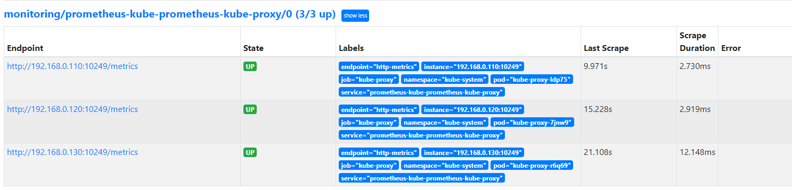
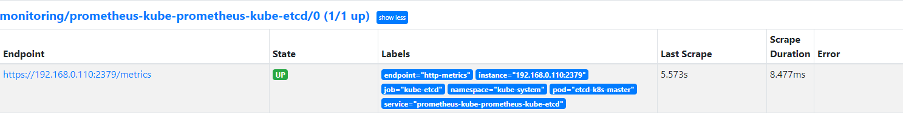
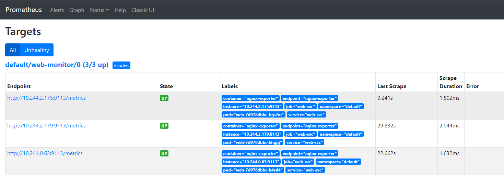
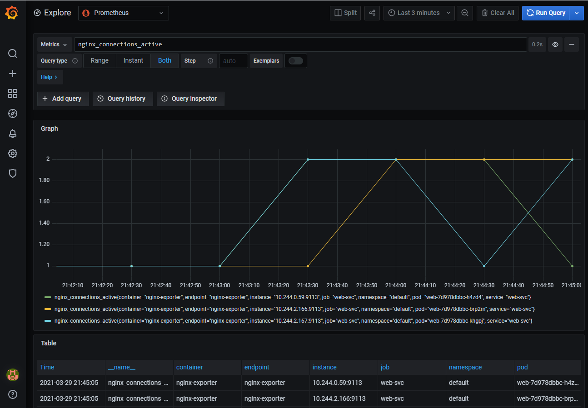
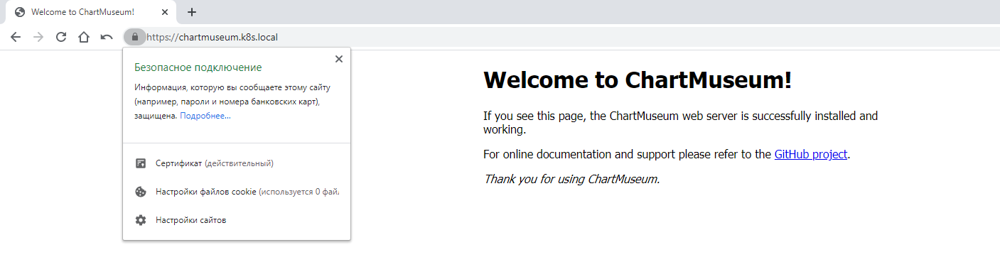

# vitrez_platform
vitrez Platform repository

<details>
  <summary>## Домашняя работа 8</summary>

  ## kubernetes-monitor

Выбран 4 вариант сложности: Поставить prometheus-operator при помощи helm3.

- Helm-чарт для prometheus-operator называется kube-prometheus-stack. Переопределяем нужные нам параметры в values.yaml и ставим его:
```
helm upgrade --install prometheus prometheus-community/kube-prometheus-stack -f kube-prometheus-stack/values.yaml --namespace monitor --create-namespace
```

- Т.к. кластер K8s у меня локальный (на базе k1s), то возникли некоторые проблемы с мониторингом:
  - не мониторятся kube-proxy на нодах
  - не мониторится etcd
Решим эти проблемы.
  1) По дефолту kube-proxy отдает метрики только через localhost.
Чтобы prometheus-operator смог забирать метрики нужно чтобы kube-proxy слушал адрес 0.0.0.0. Для этого необходимо поправить его настройки в ConfigMap:
```
$ kubectl edit configmaps kube-proxy -n kube-system
```
устанавливаем следующий параметр:
```
metricsBindAddress: "0.0.0.0:10249"
```
Сохраняем и перзапускаем поды DaemonSet kube-proxy:
```
$ kubectl rollout restart daemonset kube-proxy -n kube-system
```
  2) Чтобы снимать метрики с etcd необходима двусторонняя аутентификация по mtls.
Создадим сертификаты для Prometheus чтобы он мог успешно подключаться к etcd.
Для этого залогинимся на master-ноду (там развернут инстанс etcd) и скопируем клиентские сертификаты в новый secret:
```
kubectl create secret generic etcd-client-cert -n monitoring \
  --from-literal=etcd-ca="$(cat /etc/kubernetes/pki/etcd/ca.crt)" \
  --from-literal=etcd-client="$(cat /etc/kubernetes/pki/etcd/healthcheck-client.crt)" \
  --from-literal=etcd-client-key="$(cat /etc/kubernetes/pki/etcd/healthcheck-client.key)"
```
теперь отредактируем файл переменных для helm-чарта, добавив имя secret в prometheusSpec:
```
prometheusSpec:
  secrets:
      - etcd-client-cert
```
перенакатим чарт:
```
helm upgrade --install prometheus prometheus-community/kube-prometheus-stack -f kube-prometheus-stack/values.yaml
```
Все, проблемные сервисы завсветились в Prometheus:
kube-proxy:


etcd:


- Развернут Deployment с нашим приложением в виде контейнера nginx и sidecar-контейнера [nginx-prometheus-exporter](https://github.com/nginxinc/nginx-prometheus-exporter)
В конфигурации nginx через ConfigMap включаем отдачу метрик:
```
location = /basic_status {
stub_status;
}
``` 
Экспортеру передается аргумент для сбора метрик:
 args: [ "-nginx.scrape-uri", "http://localhost:8000/basic_status" ]

Также развернуты [Service](kubernetes-monitoring/web-svc-headless.yaml) и [Ingress](kubernetes-monitoring/ingress.yaml) для нашего приложения.

- Создан объект ServiceMonitor для сервиса приложения:
```
kubectcl apply -f kubernetes-monitoring/web-servicemonitor.yaml
```
Теперь его можно увидеть и в Prometheus:


и в Grafana:


</details>


<details>
  <summary>## Домашняя работа 7</summary>
  
  ## kubernetes-operators

### MySQL контроллер
Вопрос: почему объект создался, хотя мы создали CR, до того, как запустили контроллер?
Ответ: потому что событие никто не вычитал, оно висело в очереди kube-apiserver. После создания контроллер вычитал и обработал событие.

- Проверяем что появились pvc:
```
$ kubectl get pvc
NAME                        STATUS   VOLUME                                     CAPACITY   ACCESS MODES   STORAGECLASS   AGE
backup-mysql-instance-pvc   Bound    pvc-fcdd1f11-de02-4aa1-9ec6-3152a10ad2fe   1Gi        RWO            standard       6m27s
mysql-instance-pvc          Bound    pvc-3696f963-0d92-4433-9068-aa3c7fc6e9dc   1Gi        RWO            standard       6m27s
```

- Создадим вручную и наполним тестовую таблицу, проверим ее содержимое:
```
+----+-------------+
| id | name        |
+----+-------------+
|  1 | some data   |
|  2 | some data-2 |
+----+-------------+
```

- Удалим mysql-instance и проверим наличие pv:
```bash
$ kubectl get pv
NAME                                       CAPACITY   ACCESS MODES   RECLAIM POLICY   STATUS      CLAIM                               STORAGECLASS   REASON   AGE
backup-mysql-instance-pv                   1Gi        RWO            Retain           Available                                                               154m
```

- Создадим заново mysql-instance и, не создавая таблицу, посмотрим ее наличие:
```bash
+----+-------------+
| id | name        |
+----+-------------+
|  1 | some data   |
|  2 | some data-2 |
+----+-------------+
```
  Очевидно, что оператор отработал и база взята из бэкапа.

- Вывод комманды kubectl get jobs:
```bash
$ kubectl get jobs
NAME                         COMPLETIONS   DURATION   AGE
backup-mysql-instance-job    1/1           3s         95s
restore-mysql-instance-job   1/1           73s        79s
```

</details>

<details>
  <summary>## Домашняя работа 6</summary>
  
  ## kubernetes-templating

### 1) Подготовительные работы:

- развернут локальный кластер из 3-х виртуалок на базе k1s (с локальным лучше вникаешь во внутреннее устройство k8s)
- для реализации Dynamic Volume Provisioning и автоматического создания PV, требуемых для многих внешних helm-чартов мною был:
  * установлен external-provisioner
    ```
    $ helm repo add nfs-subdir-external-provisioner https://kubernetes-sigs.github.io/nfs-subdir-external-provisioner/
    ```
  * поднят NFS-сервер, настроен и добавлен Default Storage Class:
    ```
    $ kubectl get sc
    NAME                   PROVISIONER                                     RECLAIMPOLICY   VOLUMEBINDINGMODE   ALLOWVOLUMEEXPANSION   AGE
    nfs-client (default)   cluster.local/nfs-subdir-external-provisioner   Delete          Immediate           true                   9d
    ```
- установлен Helm 3 на локальную машину

### 2) Работа с helm. Разворачивание сервисов:

- [сnginx-ingress](https://github.com/helm/charts/tree/master/stable/nginx-ingress) сервис, обеспечивающий доступ к публичным ресурсам кластера
- [cert-manager](https://github.com/jetstack/cert-manager/tree/master/deploy/charts/cert-manager) - сервис, позволяющий динамически генерировать Let's Encrypt сертификаты для ingress ресурсов
- [chartmuseum](https://github.com/helm/charts/tree/master/stable/chartmuseum) - специализированный репозиторий для хранения helm charts 
- [harbor](https://github.com/goharbor/harbor-helm) - хранилище артефактов общего назначения (Docker Registry), поддерживающее helm charts

### 3) Cert-manager. Самостоятельное задание. 

- Изучите [документацию](https://docs.cert-manager.io/en/latest/) cert-manager, и определите, что еще требуется установить для корректной работы
- Т.к. у меня кластер локальный и не имеет "белого" IP, то решено опробовать самоподписанные сертификаты
- Манифест дополнительно созданного ресурса для создания самоподписанных сертификатов размещен в kubernetes-templating/cert-manager/selfSigned.yaml

### 4) Chartmuseum.

-  произведена кастомизированная установка chartmuseum, параметры  размещены в kubernetes-templating/chartmuseum/values.yaml
-  проверена успешность устаноки:
a) Chartmuseum доступен по URL https://chartmuseum.k8s.local (резолв имени через файл hosts)
b) Сертификат для данного URL валиден (сертификат вручную добавлен в доверенные)


### 5) Задание со (*)

- Научитесь работать с chartmuseum 
- Опишите последовательность действий, необходимых для добавления туда helm chart's и их установки с использованием chartmuseum как репозитория

Воспользовался [инструкцией](https://chartmuseum.com/docs/#uploading-a-chart-package)

```
cd kubernetes-templating/chartmuseum/consul
helm package .
curl -k --data-binary "@consul-3.9.6.tgz" https://chartmuseum.k8s.local/api/charts
helm repo add chartmuseum https://chartmuseum.k8s.local
helm search repo consul
helm install consul chartmuseum/consul --wait
helm delete consul
```

### 6) Harbor. Самостоятельное задание

- Установлен harbor в кластер с использованием helm3 (используя репозиторий)  
- Включен ingress и настроен host harbor.k8s.local
- Включен TLS и выписан самоподписанный сертификат
- Используемый файл values.yaml размещен в директорию kubernetes-templating/harbor/

### 7) Helmfile. Задание со (*)

Перед использованием helmfile:
```
helm plugin install https://github.com/databus23/helm-diff
```
Описана установка nginx-ingress, cert-manager и harbor в helmfile в виде релизов.
Получившиеся файлы размещены в kubernetes-templating/helmfile/
Harbor установился с использованием самоподписанного серификата и отвечает по имени harbor.k8s.local.

### 8) Создаем свой helm chart 

Используем [hipster-shop](https://github.com/GoogleCloudPlatform/microservices-demo) - демо-приложение , представляющее собой типичный набор микросервисов.

-  изначально все сервисы создаются из одного манифеста kubernetes-templating/hipster-shop/templates/all-hipstershop.yaml 
-  вынесен микросервис frontend в директорию kubernetes-templating/frontend
-  добавлена шаблонизация values.yaml для frontend
-  добавлены зависимости для frontend от микросервисного приложения hipster-shop
-  Задание со **
   * сервис Redis устанавливается, как зависимость с использованием bitnami community chart

### 9) Kubecfg

Kubecfg предполагает хранение манифестов в файлах формата .jsonnet и их генерацию перед установкой. 
Общая логика работы с использованием jsonnet следующая:
  * Пишем общий для сервисов , включающий описание service и deployment
  * [наследуемся](https://raw.githubusercontent.com/express42/otus-platform-snippets/master/Module-04/05-Templating/hipster-shop-jsonnet/payment-shipping.jsonnet) от него, указывая параметры для конкретных сервисов 

-  вынесены манифесты, описывающие service и deployment для микросервисов paymentservice и shippingservice из файла all-hipster-shop.yaml в директорию kubernetes-templating/kubecfg
-  установлен kubecfg
-  создан services.jsonnet
-  библиотеку kube.libsonnet пришлось скачать локально чтобы подкорректировать версии api
-  проверка, что манифесты генерируются корректно:
```
kubecfg show services.jsonnet
```
-  установка манифестов:
```
kubecfg update services.jsonnet --namespace hipster-shop
```

### 10) Kustomize | Самостоятельное задание

-  отпилен микросервис cartservice от hipster-shop
-  реализована установка в окружениях dev и prod
-  результаты работы помещены в директорию kubernetes-templating/kustomize 
-  в установке на окружение dev в неймспейсе hipster-shop для совместимости с остальными сервисами из all-hipstershop.yaml пришлось закомментировать namePrefix

установка на окружение dev запускается так:
```
kubectl apply -k kubernetes-templating/kustomize/overrides/hipster-shop
```
</details>

<details>
  <summary>## Домашняя работа 5</summary>
  
  ## kubernetes-volumes

Что было сделано:

- Созданы манифесты для использования minio

- Задание со *
Добавлены манифесты для secret и манифест Statefulset с их использованием

</details>

<details>
  <summary>## Домашняя работа 4</summary>

  ## kubernetes-network

Что было сделано:

- Работа с тестовым веб-приложением
    Добавление проверок Pod
    Создание объекта Deployment
    Добавление сервисов в кластер ( ClusterIP )
    Включение режима балансировки IPVS
- Установка MetalLB в Layer2-режиме
- Добавление сервиса LoadBalancer
- Установка Ingress-контроллера и прокси ingress-nginx
- Создание правил Ingress

- Задание со *
Создан сервис LoadBalancer , который открывает доступ к CoreDNS снаружи кластера (позволяет получать записи через внешний IP).
Сервис работает по протоколам TCP и UDP на одно ip-адресе балансировщика.
Использована аннотация: metallb.universe.tf/allow-shared-ip

- Задание со * Ingress для Dashboard
Добавлен доступ к kubernetes-dashboard через наш Ingress-прокси: сервис доступен через префикс /dashboard.

- Задание со * Canary для Ingress
Реализовано канареечное развертывание с помощью ingress-nginx: часть трафика перенаправляется на выделенную группу подов используя вес (в процентах).

</details>

<details>
  <summary>## Домашняя работа 3</summary>

  ## kubernetes-security

Что было сделано:

- Создан Service Account bob с ролью admin в рамках всего кластера
- Создан Service Account dave без доступа к кластеру
для создания манифестов можно использовать dry-run запуск консольных команд:
```
kubectl create serviceaccount bob --dry-run=client -o yaml > 01-serviceaccount-bob.yaml
kubectl create clusterrolebinding bob-rolebinding --clusterrole=admin --serviceaccount=default:bob  --dry-run=client -o yaml > 02-rolebinding-bob.yaml
kubectl create serviceaccount dave --dry-run=client -o yaml > 03-serviceaccount-dave.yaml
```

- Создан Namespace prometheus
- Создан Service Account carol в Namespace prometheus
- Всем Service Account в Namespace prometheus дана возможность делать get, list, watch в отношении Pods всего кластера
- Создан Namespace dev
- Создан Service Account jane в Namespace dev
- Service Account jane выдана роль admin в рамках Namespace dev
- Создан Service Account ken в Namespace dev
- Service Account ken выдана роль view в рамках Namespace dev

</details>

<details>
  <summary>## Домашняя работа 2</summary>

  ## kubernetes-controllers

Что было сделано:

- Установлен kind и создан кластер
- Создан и применен манифест frontend-replicaset.yaml
- Собран и помещен в Docker Hub образ микросервиса paymentService с двумя тегами v0.0.1 и v0.0.2
- Создан и запущен манифест paymentservice-replicaset.yaml с 3 репликами
- Создан и запущен манифест paymentservice-deployment.yaml с 3 репликами
- Обновлен Deployment на версию образа v0.0.2
- С использованием параметров maxSurge и maxUnavailable реализовал два сценария развертывания: "Аналог blue-green" и "Reverse Rolling Update"
- Создал манифест frontend-deployment.yaml с 3 репликами с тегом образа v0.0.1
- Добавил описание readinessProbe
- Нашел node-exporter-daemonset.yaml, отредактировал и убедился, что он разворачивается в том числе и на master нодах

</details>

<details>
  <summary>## Домашняя работа 1</summary>

  ## kubernetes-intro

Что было сделано:

- Выполнена установка minikube;
- Ознакомлен с интерфейсом dashboard;
- Разобрался почему все pod в namespace kube-system восстановились после удаления: kube-proxy - управляется daemonset, core-dns - управляется deployment (replicaset); kube-apiserver - это static pod;
- Cоздан dockerfile согласно требованиям,образ собран и залит в dockerhub;
- Написан манифест web-pod.yaml;
- Выяснена причина, по которой pod frontend находился в статусе Error, в логах пода было  panic: environment variable "PRODUCT_CATALOG_SERVICE_ADDR" not set; Соответственно был добавлен набор переменных из оригинального манифеста в frontend-pod-healthy.yaml.

</details>
